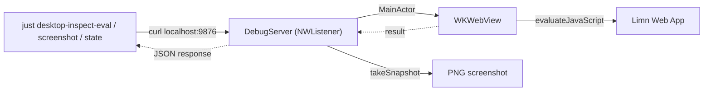

# Testing

## Philosophy

Red/green TDD -- write failing tests first, then make them pass. Testing is a first-class citizen.

## JS/TS Tests (vitest)

```bash
just test             # Run all unit tests
just test-file drag   # Run a specific test file (matches by name)
just test-watch       # Run tests in watch mode
just coverage         # Run tests with coverage report
just check            # Full CI check: tests + lint + typecheck + obsidian build
```

Tests live alongside source in `packages/core/src/__tests__/` and `packages/web/src/__tests__/`.

## Swift Unit Tests (XCTest)

```bash
just desktop-test     # Build and run all desktop unit tests
```

Tests live in `packages/desktop/LimnTests/`. Test testable logic (URL handling, data parsing, coordinator registry) without requiring a running app. Use `@testable import Limn` for internal access.

## Debug Server (ad-hoc inspection)

Debug builds include a lightweight HTTP server on `localhost:9876` for programmatic inspection of the running app. Only compiled in `#if DEBUG` -- never ships in Release.

### Architecture



### Commands

```bash
just desktop-inspect-windows                                        # List all open windows
just desktop-inspect-eval 'document.querySelectorAll("[data-node-id]").length'  # Eval JS in first window
just desktop-inspect-eval 'document.title' file=test-b.limn         # Eval JS in specific window
just desktop-inspect-screenshot                                     # Screenshot first window (timestamped)
just desktop-inspect-screenshot file=test-b.limn                    # Screenshot specific window
just desktop-inspect-state                                          # Node count, filename, selection
just desktop-inspect-state file=test-a.limn                         # State for specific window
just desktop-inspect-json                                           # Full document JSON
```

Screenshots and other inspection artifacts save to `.llm/inspect/` (gitignored).

### Endpoints

| Endpoint | Method | Description |
|----------|--------|-------------|
| `/windows` | GET | List all open windows with index, filename, URL |
| `/eval` | POST | Evaluate JS in WKWebView, body = JS code |
| `/screenshot` | GET | Capture WKWebView as PNG |
| `/state` | GET | Shortcut for node count, selection, filename, zoom |

All endpoints except `/windows` accept `?file=<filename>` to target a specific window. Defaults to the first registered window.

### `/desktop-inspect` skill

The `/desktop-inspect` skill (`.claude/skills/desktop-inspect/SKILL.md`) lets Claude use the debug server autonomously. Instead of asking Ted to manually check the app, Claude can evaluate JS, capture screenshots, and read editor state directly. Invoke it with `/desktop-inspect` or let it trigger automatically when investigating desktop app behavior.

## When to Use What

- **Unit tests** (`just test`, `just desktop-test`): Logic, data transformations, state management. Always prefer these.
- **Debug server** (`just desktop-inspect-eval`, etc.): Ad-hoc inspection during development. Verify rendering, check for JS errors, capture screenshots for visual review.
- **`/desktop-inspect` skill**: When Claude needs to investigate the running app without manual intervention from Ted.
